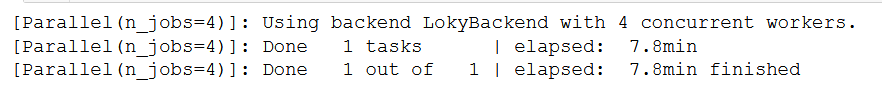
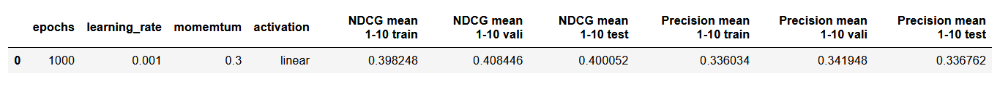
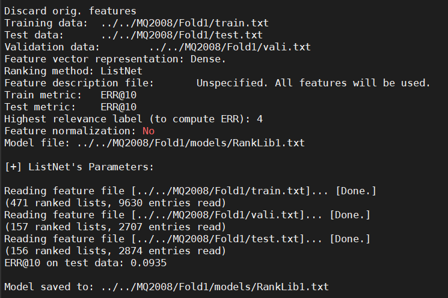
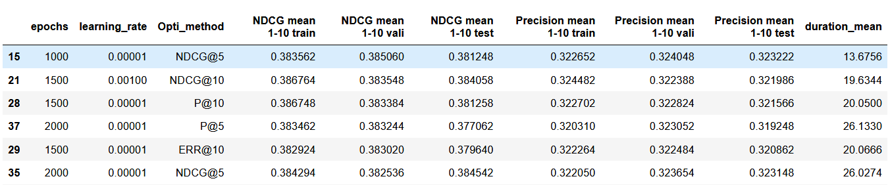
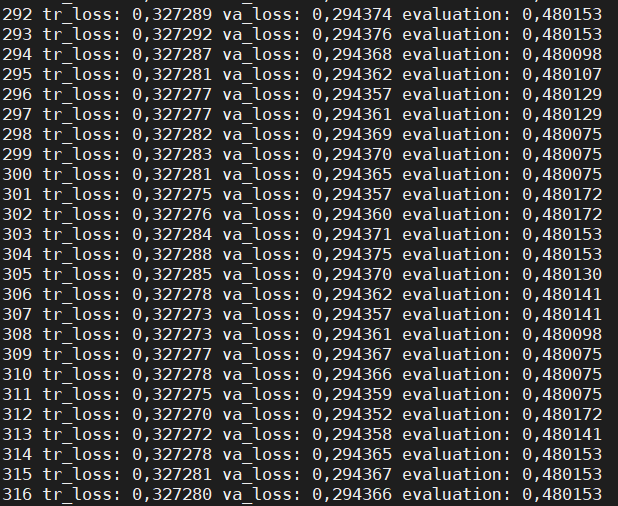
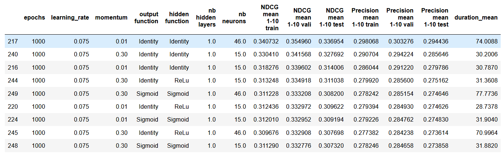
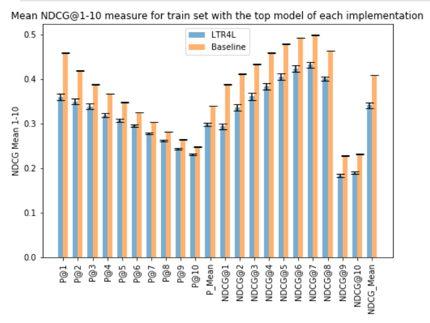
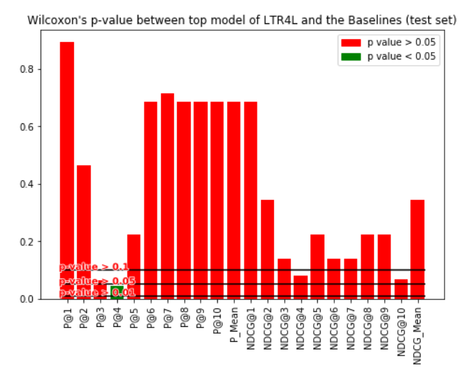

# ListNet Reproductibility

## Code to build the model and run the analyses
The code used for this experiment is contained in the folder **code**. It will compare the performance of three different ListNet implementations between themselves and the baseline on the dataset LETOR 4.0. The goal is to determine if our implementation is close to the original ListNet algorithm.

Before running it, it is necessary to add the datasets which are supposed to be contained in the MQ2007 and MQ2008 folders. As they were too large to be kept in the Git repository, please use the following link to retrieve them and add them locally in their corresponding folder : https://onedrive.live.com/?authkey=%21ACnoZZSZVfHPJd0&id=8FEADC23D838BDA8%21107&cid=8FEADC23D838BDA8. Add the *min.txt* dataset at the root of each folder and the three subsets (*train.txt*, *vali.txt* and *test.txt*) for each of the five Folds contained in the repositories.

Four different sets of scripts can be found **code**. First, we must run *Personal implementation analysis*, *RankLib analysis* and *LTR4L analysis* in whichever order according to the following instructions:

## Personal implementation analysis
This folder contains the France Labs' implementation of ListNet. 

First must be run the *Train MQ200...* scripts. The order is not important. Please be aware that these script are quite resourceful, running them simulteanously is possible but might impact the performance of your computer. It can take between several hours to a few days before each script finish their execution. If functionning correctly, the script should return the following messages during its execution (for jupyter) : 

When every train scripts have successfully ended (no error returned), the remaining *Evaluation MQ200...* scripts must be run. These scripts are used to measure the performance of each generated model created previously. If working correctly, they should present the best results in the form of table (for jupyter) :

The remaining two scripts are used to analyze statiscally each dataset. They are not necessary to reproduce this experiment.

## RankLib analysis
This folder contains the RankLib's implementation of ListNet.

The scripts must be run in the specific order *Train LETOR RankLib* => *Predict LETOR RankLib* => *Evaluation LETOR RankLib*.

The *Train LETOR RankLib* script will generate two shell scripts: *RankLib_run_MQ2008.sh* and *RankLib_run_MQ2007.sh* that must then be run using a terminal. They can be run simulteanously. If it is working correctly, the following messages should be displayed while the scripts are running:

The *Predict LETOR RankLib* will also generate two shell scripts that will be automatically run through python. If run correctly, jupyter should simply return "0".

Finally the *Evaluation LETOR RankLib* will measure the performance of each generated model created previously. If working correctly, they should present the best results in the form of table (for jupyter) :

## LTR4L analysis
This folder contains the LTR4L's implementation of ListNet.

The scripts must be run in the specific order *Train LETOR LTR4L* => *Predict LETOR LTR4L* => *Evaluation LETOR LTR4L*.

The *Train LETOR LTR4L* script will generate two shell scripts: *LTR4L_run_MQ2008.sh* and *LTR4L_run_MQ2007.sh* that must then be run using a terminal. They can be run simulteanously. If it is working correctly, the following messages should be displayed while the scripts are running:

The *Predict LETOR LTR4L* will also generate two shell scripts that will be automatically run through python. If run correctly, jupyter should simply return "0".

Finally the *Evaluation LETOR LTR4L* will measure the performance of each generated model created previously. If working correctly, they should present the best results in the form of table (for jupyter) :

## Libs comparison
Once every implementations have been tested and measured, we can run these scripts to compare their performances.

Each script can be run through jupyter and will return the comparison between the performance of two implementations and the Wilcoxon's signed-ranked test that will define whether or not the observed differences are significant.

